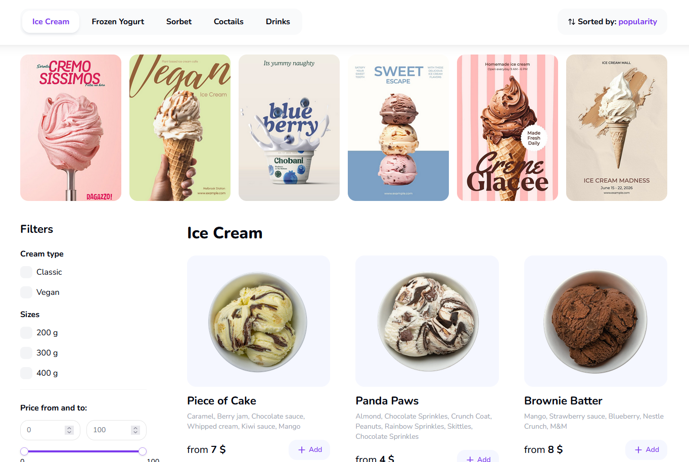
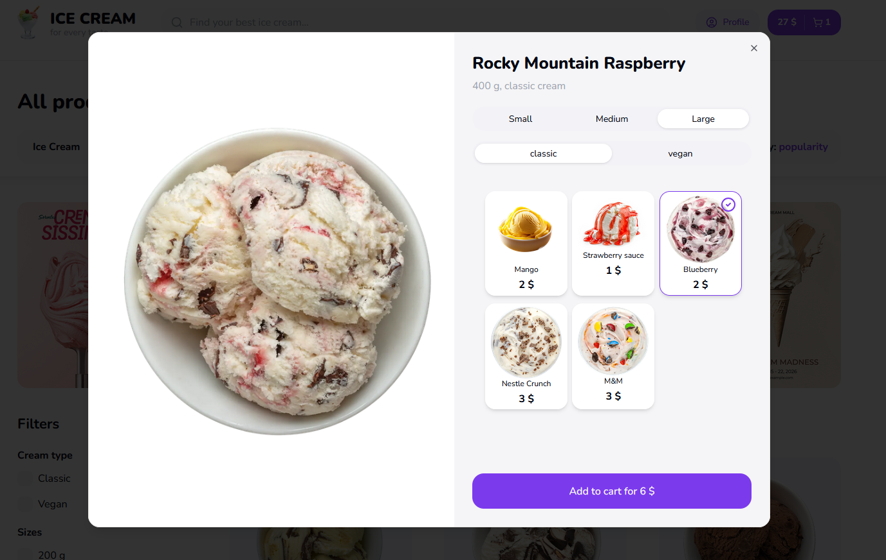

# 🍦 Pretty Ice Cream

Full-stack e-commerce app for browsing, customizing, and ordering ice cream online.

## 🔗 Links

🌐 App: https://pretty-ice-cream.vercel.app
  
## ✨ Features

* Browse products with search and filters
* Customize items (size, type, extra ingredients)
* Shopping cart and order flow
* Checkout form with address suggestions (DaData)
* Test payments via Stripe
* Email notifications via Resend
* Authentication with NextAuth (Google, GitHub)
* Stories-style UI (react-insta-stories)

## ⚙️ Tech Stack

**App**

* Next.js (App Router, TypeScript)

**Database**

* PostgreSQL
* Prisma

**Frontend**

* Zustand
* Axios
* Tailwind CSS + shadcn/ui
* React Hook Form + Zod
* react-dadata
* react-insta-stories

**Backend / Integrations**

* Next.js API routes
* NextAuth
* Stripe
* Resend

**Deployment**

* Vercel

## 🚀 Run locally

```bash
git clone https://github.com/Flanele/pretty-ice-cream.git
cd pretty-ice-cream
npm install
cp .env.example .env
npm run dev
```


## 📸 Preview





